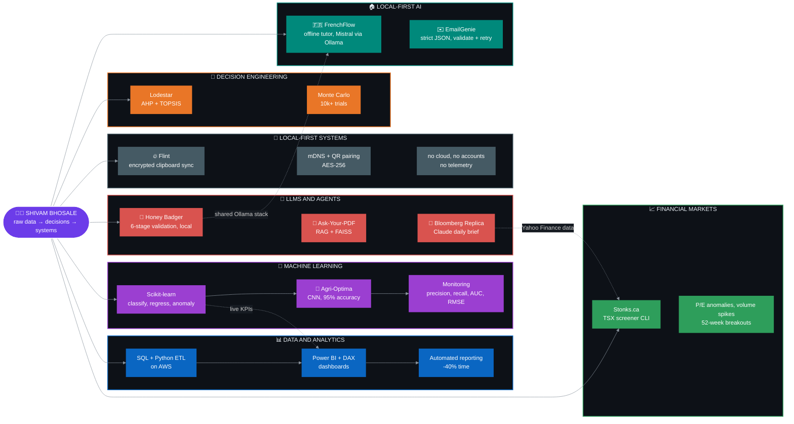

<!-- ============================== BANNER ============================== -->

  

  

  
  
  

  📍 Toronto, Canada &nbsp;·&nbsp; 🟢 <b>Open to new opportunities</b> &nbsp;·&nbsp; 🏠 Hybrid / Remote

---

## 👋 The Brief

I build across the full analytics stack: **SQL and Python pipelines**, **Power BI dashboards**, **LLM agents**, **financial screeners**, and **locally run AI systems**.

Right now I'm a Data Analyst at **MJR Capital**, shipping ML models to production. Side hours go to agentic AI, reliability-first LLM pipelines, and a few too many side projects.

Seven territories, one habit: ship the thing. Solid lines are workflows, dotted lines are where one lane feeds another.

---

## 🚀 Featured Projects

<table>
  <tr>
    <td width="50%" valign="top">
      <h3>🧭 <a href="https://github.com/ShivamBhosale">Lodestar</a></h3>
      <b>DECISION ENGINEERING</b>  
      Stacks <b>AHP + TOPSIS + Monte Carlo</b> (10k+ simulations) to weight, rank, and stress-test life and work decisions. The data person's antidote to gut feel.  
      
      
      
      
    </td>
    <td width="50%" valign="top">
      <h3>🔥 <a href="https://github.com/ShivamBhosale/flint">Flint</a></h3>
      <b>CROSS-DEVICE CLIPBOARD</b>  
      Clipboard sync across <b>Mac, Android, and Chrome</b> over your local network. Devices find each other via mDNS and pair by QR. <b>AES-256 end-to-end encrypted. No cloud, no accounts, no telemetry.</b>  
      
      
      
      
    </td>
  </tr>
  <tr>
    <td width="50%" valign="top">
      <h3>📈 <a href="https://github.com/ShivamBhosale/Stonks.ca">Stonks.ca</a></h3>
      <b>TSX STOCK SCREENER CLI</b>  
      Real-time scanner for Canadian equities and ETFs. Flags <b>P/E anomalies, volume spikes, 52-week breakouts</b>, and momentum, with plain-English signals and a CSV trade log. No API key needed.  
      
      
      
      
    </td>
    <td width="50%" valign="top">
      <h3>🦡 <a href="https://github.com/ShivamBhosale/Honey-Badger---AI-Assistant">Honey Badger AI</a></h3>
      <b>RELIABILITY-FIRST GENAI</b>  
      Every response is <b>generated → critiqued → revised → rule-evaluated → confidence-scored → guardrailed</b> before you see it. Fully local via Ollama, no API key.  
      
      
      
      
    </td>
  </tr>
  <tr>
    <td width="50%" valign="top">
      <h3>🏦 <a href="https://github.com/ShivamBhosale">Bloomberg Replica</a></h3>
      <b>LLM MARKET INTEL</b>  
      Claude reads equities, FX, and macro from free APIs and writes an <b>institutional-style daily brief</b>. Built for retail users, at zero subscription cost.  
      
      
      
      
    </td>
    <td width="50%" valign="top">
      <h3>🌾 <a href="https://github.com/ShivamBhosale/Agri-Optima">Agri-Optima</a></h3>
      <b>DEEP LEARNING FOR AGRICULTURE</b>  
      Django + CNN platform for farmers: <b>crop yield prediction</b>, leaf disease detection, soil analysis, and a live news feed. Built with Agriculture &amp; Agri-Food Canada. <b>35k images, 95% accuracy, +15% over baseline.</b>  
      
      
      
      
    </td>
  </tr>
  <tr>
    <td colspan="2" valign="top">
      <h3>📄 <a href="https://github.com/ShivamBhosale/Ask-you-pdf">Ask-Your-PDF</a></h3>
      <b>RAG DOCUMENT Q&amp;A</b>  
      Ask any PDF questions in plain English. Chunks the document, builds FAISS embeddings, and forces the LLM to answer <b>strictly from retrieved context</b>.  
      
      
      
      
    </td>
  </tr>
</table>

### 🧪 More Builds

<table>
  <tr>
    <td width="50%" valign="top">
      <h3>🌬️ <a href="https://github.com/ShivamBhosale/BreatheBeat">BreatheBeat</a> &nbsp;</h3>
      <b>MEDITATION AND BREATHING GUIDE</b>  
      Stopwatch and timer with three guided breathing rhythms (4-7-8, box breathing, 4-2-4), day streaks, lo-fi audio, and a warm "Soft Clay" design. <b>Zero build step, pure HTML, CSS, and JS.</b>  
      
      
      
    </td>
    <td width="50%" valign="top">
      <h3>🇫🇷 <a href="https://github.com/ShivamBhosale/FrenchFlow">FrenchFlow</a></h3>
      <b>OFFLINE FRENCH TUTOR</b>  
      Flashcards with spaced repetition, AI grammar drills, a conversation tutor with inline corrections, and a translation checker. <b>Runs fully offline on Ollama + Mistral. No API keys, no subscriptions.</b>  
      
      
      
      
    </td>
  </tr>
  <tr>
    <td width="50%" valign="top">
      <h3>✉️ <a href="https://github.com/ShivamBhosale/EmailGenie">EmailGenie</a></h3>
      <b>RELIABLE STRUCTURED LLM OUTPUT</b>  
      LLMs break format rules, so this one doesn't get the chance. A local model must return <b>strict JSON</b>, with self-healing extraction, schema validation, and automatic retries.  
      
      
      
      
    </td>
    <td width="50%" valign="top">
      <h3>🦫 <a href="https://github.com/ShivamBhosale/Capy">Capy</a></h3>
      <b>DESKTOP COMPANION</b>  
      A 3D capybara that lives on your screen, tracks your cursor, hunches over to type along with you, and <b>celebrates when Claude Code finishes a task</b>. Controllable via hotkeys or a local HTTP endpoint.  
      
      
      
    </td>
  </tr>
  <tr>
    <td colspan="2" valign="top">
      <h3>📡 <a href="https://github.com/ShivamBhosale/nexus-signal">Nexus Signal</a></h3>
      <b>AI-SUMMARIZED TECH AND SCIENCE NEWS</b>  
      Pulls articles from NewsData.io and RSS feeds (Ars Technica, MIT Tech Review, IEEE Spectrum, Nature), summarizes them with <b>Gemini 2.5 Flash</b>, and refreshes every 30 minutes. Built with a <b>freemium model</b>: 5 free articles per session, unlimited with a license key.  
      
      
      
      
      
    </td>
  </tr>
</table>

---

## 🛠️ Tech Stack

  

<table>
  <tr>
    <td><b>📊 Analytics and SQL</b></td>
    <td>Pandas · NumPy · PySpark · R · advanced SQL (CTEs, window functions) · EDA · feature engineering</td>
  </tr>
  <tr>
    <td><b>🧠 ML and Deep Learning</b></td>
    <td>Scikit-learn · TensorFlow · PyTorch · Keras · CNNs · anomaly detection · hyperparameter tuning · precision / recall / AUC / RMSE</td>
  </tr>
  <tr>
    <td><b>🤖 LLMs and Agentic AI</b></td>
    <td>Claude API · OpenAI · Gemini · RAG · FAISS · LangChain · LangGraph · CrewAI · MCP · A2A · Ollama</td>
  </tr>
  <tr>
    <td><b>📈 BI and Reporting</b></td>
    <td>Power BI · DAX · Tableau · Power Automate · Excel</td>
  </tr>
  <tr>
    <td><b>🗄️ Databases</b></td>
    <td>PostgreSQL · SQL Server · MySQL · MongoDB · query optimization · schema design</td>
  </tr>
  <tr>
    <td><b>☁️ Cloud, MLOps and App Dev</b></td>
    <td>AWS (S3, EC2) · Azure · GCP · Docker · CI/CD · FastAPI · Flask · Django · Streamlit · REST APIs</td>
  </tr>
</table>

---

## 🔭 Currently Exploring

`Multi-agent orchestration` &nbsp; `Long-context RAG + eval harnesses` &nbsp; `dbt and the modern data stack` &nbsp; `Decision engineering (AHP, TOPSIS)` &nbsp; `LLM-as-judge`

---

## 📬 Get in Touch

**Hiring an analyst who thinks like an engineer? Let's talk.**

  
  
  

<i>"Good decisions start with clean data."</i>

  

